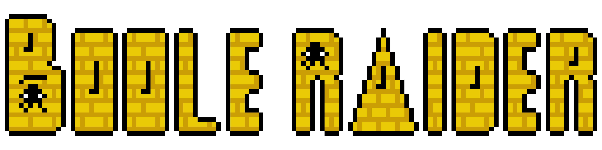
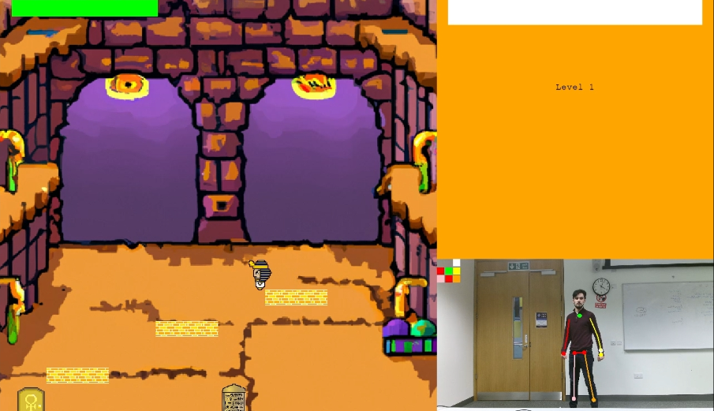
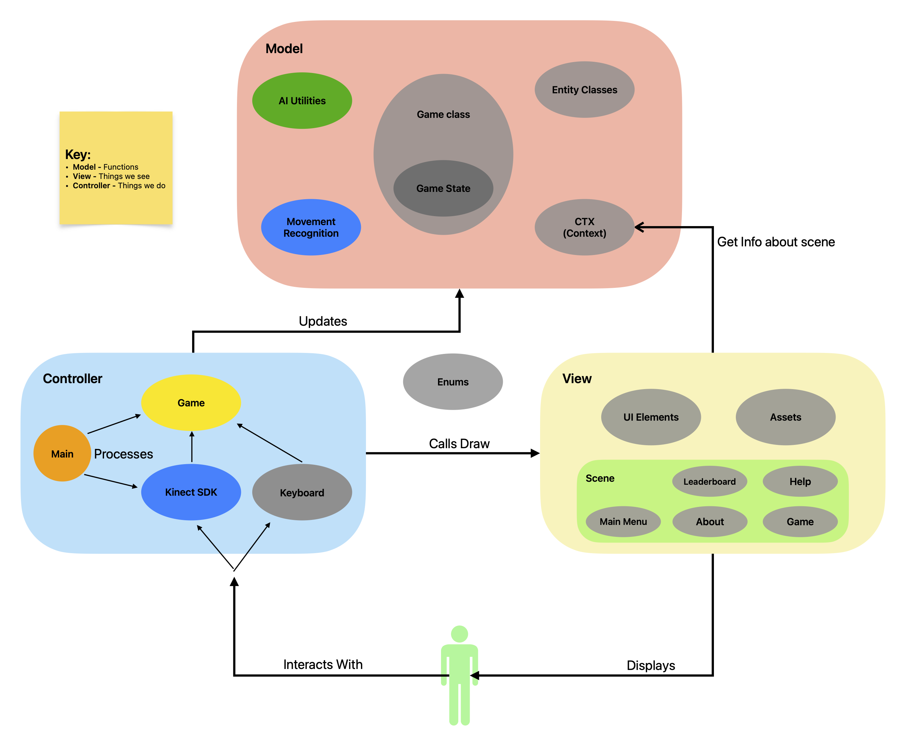
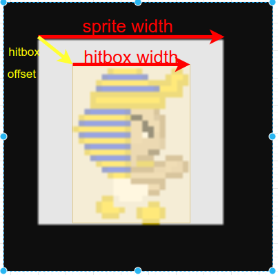
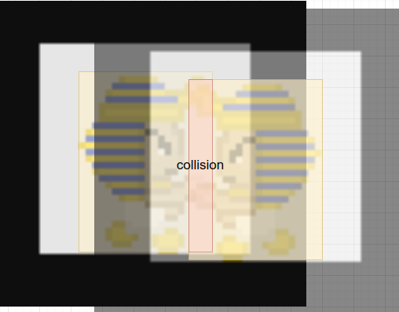
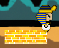
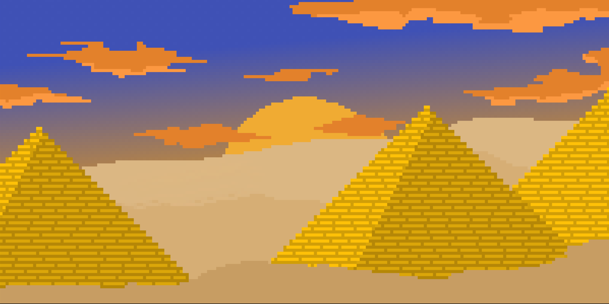
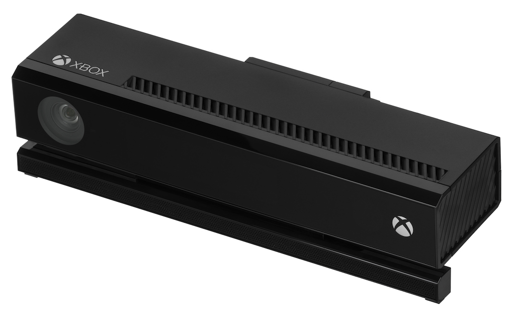
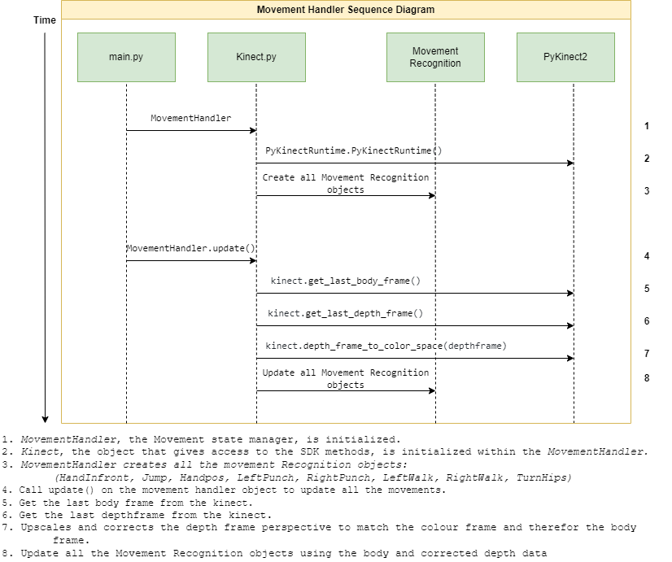

<p align="center">

</p>

<p align="center"> •
  <a href="#intro">Summary</a> •
  <a href="#core-technologies">Core Technologies</a> •
  <a href="#architecture">Architecture</a> •
  <a href="#model">Model</a> •
  <a href="#view">View</a> •
  <a href="#controller">Controller</a> •
  <a href="#kinect">Kinect</a> •
  <a href="#development">Development</a> •
</p>

---
<p align="center">

</p>

## Intro
Boole Raider is an **experimental 2D roguelike platformer**. The player controls the character using machine vision. This is achieved through the use of a Kinect. The text - and parts of the art - are generated using GPT-3 and DALL.E respectively.

## Core Technologies

### Machine Vision
The game can be controlled using **machine vision**, in a similar manner to the games developed for the Xbox Kinect on the Xbox console. After some exploration into OpenCV libraries, such as OpenPose and the Nvidia libraries for the Jetson Nano, we concluded that the [Kineck SDK](https://learn.microsoft.com/en-us/previous-versions/windows/kinect/dn799271(v=ieb.10)) for Windows was the best option.


### Pygame
`Pygame`is a popular Python library for game development that provides a set of tools and functionalities for creating 2D games. It includes modules for graphics, sound, input handling, and more. Pygame is the most well-known and stable of Python libraries for this type of development, with over [5,000 stars on Github](https://github.com/pygame/pygame).

Below are some of the methods that we have used in this project.
1. `pygame.init()` - Initializes Pygame and prepares it for use in the program.
2. `pygame.display.set_mode()` - Creates a `Surface` object for the game, upon which all of the graphics are drawn.
3. `pygame.display.update()` - Updates the game screen and displays any changes made since the last update.
4. `pygame.time.Clock()` - creates a `Clock` object that can be used to control the game's frame rate and limit the number of updates per second.
5. `pygame.sprite.Sprite`- Represents a game object or entity, with properties like position, speed, and image.
6. `pygame.draw`- Provides various methods for drawing shapes and lines, filling shapes with colors, and rendering text.

By using these methods in combination with Python's object-oriented programming capabilities, we were able to build a robust and well-architectured game.

### AI
[OpenAI](https://openai.com/) is a leading AI research company that is best known for its well-publicised deep learning models. In light of this technology's potential, we made the decision to integrate the models provided by OpenAI into our game.

#### **GPT-3**
We decided to use GPT-3 to generate the storyline and in-game text. The cost of using this model for this purpose was minimal. The only necessity to use this for our game, was to engineer a prompt that returned a consistently formatted response for Pygame to ingest.

#### **DALL.E**
We decided to use DALL.E only for background image generation. There were two main reasons for this:
- Deep learning models do not handle asset background transparency very well, and we did not want to perform any image post-processing in the course of this project.
- Spritesheets generated by AI may not be consistently spaced or regularly formatted - and we also wanted to do a fair amount of the art ourselves, by hand.

----
## Architecture
The architecture of the application is a model-view-controller design. The application is divided into 3 parts:

### 1. The Controller
This is the module that the main game loop runs in. It is responsible receiving user input and calling the necessary services in the other modules, based on the input of the user.

### 2. The Model
This is the a module that represents the state of the game and contains all game state data and state management logic that can be logically separated from the hardware it is running on (such as the Kinect) and the game engine used to display it (Pygame itself).

### 3. The View
This is the module that is used to display the information contained in model. For this project, we used the Pygame game engine to run the game.



### Why this architecture?
The rationale behind the selection of this architecture is as follows:

#### 1. Separation
Due to how this application dealt with the interaction of many different kinds of technologies, it was crucial to segregate the application into distinct pieces. This also facilitated development on our team of six people.

#### 2. Modularity 
Because the code was written to run on different types of systems (with the Kinect or without the Kinect, for example) we had to ensure that the core of the application remained the same, regardless of the hardware.

#### 3. Upgradability
It was very beneficial to have the freedom to alter or replace individual components in the application without any impact on the overall system, due to well-defined interfaces between modules. This approach was facilitated by our architecture of choice.


## Model
The model was designed to represent the game's state and functionality in a way that is agnostic to the machine, input type and game engine.

### Game Objects
The game objects were stored in the model directory to separate the game's logic and state from Pygame (the game engine). This was because Pygame is a primarily view-oriented component of the overall system, and as such, the Pygame-relevant code belonged in the view directory instead.

The decision to put the game objects in the model directory lead not only to a more readable code, but the development process was not blocked by the game engine. The engine could be swapped out for alternatives in the future, as most of the objects are not intrinsically tied to the game's rendering system. This decoupling also facilitated development on the UI.

### Interfacing with the game objects
- In the model directory, there is a file named `game_interface.py`. The primary goal of this file is to centralise and manage the state of the game - that is, the model of the game - from one place.
- This file contains two important classes: `PlatformerGame` and `CtxToRender`.
- `PlatformerGame` is the main game object that is instantiated in the controller and represents the current state of the game at a conceptual level - for example, the player's current position is tracked here.
- `CtxToRender` is the interface consumed by the view to render the game onto a canvas. This class is returned when `PlatformerGame.get_render_ctx()` is called.
- Below is an example that returns the player's $x$ coordinate.
```python3 
game = PlatformerGame()
ctx = game.get_render_ctx()
print(ctx.player.x)
```
- The controller (`main.py`) displays the game using the `Scene` class. This class is defined in the view directory.
- The `Scene` class ingests the state of the game from the `PlatformerGame` object.
- For example, if the game state - defined in the `PlatformerGame` object - is `GameState.start_menu`, then the menu's UI elements will be rendered in the Pygame window. The Scene's `update` method can then be used to fetch and draw the current state of the game.
- This is illustrated by the example below.
```python3
gamemanager = PlatformerGame()
gamepanel = Scene(gamemanager)

while True:
    gamePanel.update()
```

### Game Objects
The `PlatformerGame` object relies on the following objects.

#### Entity
The Entity class is the parent class of any object that is drawn to the screen. It contains attributes that any drawable object would need, such as $x$ and $y$ coordinates, width, or height.

The below code snippet demonstrates the boilerplate code for this class.
```python3
class Entity:
    """
    Attributes:
                coordinates: The object's position on the tilemap.
                width: The width of the object.
                height: The height of the object.
                xPos: the x co-ordenate of the entity on the game plane
                    that will be displayed on the screen
                yPos: the y co-ordenate of the entity on the game plane
                    that will be displayed on the screen.
    """
    ..........
```
The following instance variables can be set in all entities, and via inheritance, all subclasses also have a defined collision hitbox. However, there is a discrepancy between the sprite size and hitbox size, so we must account for this.
```python3
        # creating the hitbox
        self._hitbox_x_offset = 0
        self._hitbox_y_offset = 0
        self._hitbox_width_reduction = 0
        self._hitbox_height_reduction = 0
```


The collision detection section of the entity code checks whether or not an entity is colliding with something.

```python3
 def is_colliding_with_entity(self, entity):
        if ((entity.x+entity._hitbox_x_offset) + (entity.width-entity._hitbox_width_reduction) < self.xPos) or ((self.xPos + self._hitbox_x_offset) + (self._width-self._hitbox_width_reduction) < (entity.x+entity._hitbox_x_offset)):
            return False
        if ((entity.y+entity._hitbox_y_offset) + (entity.height-entity._hitbox_height_reduction) < (self.yPos+self._hitbox_y_offset)) or ((self.yPos+self._hitbox_y_offset) + (self._height-self._hitbox_height_reduction) < (entity.y+entity._hitbox_y_offset)):
            return False

        return True

```
The collision detection of entities checks to see if two hitboxes overlap, and returns `True` if they do.



#### Block
The Block class inherits from entity, and is a entity that acts as a platform to be stood on.



### Monke
The [Monke](https://knowyourmeme.com/memes/return-to-monke) represents a humanoid player/enemy that has several distinct properties.
- The ability to move around.
- The ability to collide with other objects, such as platforms.
- The ability to be influenced by game physics, such as gravity.

This class was originally named *Hominidae*, referring to the classification of humanoid entities in nature. However, concerns were raised about the readability of this name. Other names where considered but the name Monke proved the most memorable and understandable while being short, elegant and to the point.

The below code snippet demonstrates boilerplate code for this class.
```python3
class Monke(Entity):
    def collideTop(self, entities: list[Entity]) -> bool:
       """
       collideTop is an internal method that
       checks if the Monke is on top of a block.

        Args: 
            blocks: a list of block objects representing
            the block platforms on the screen 
            that can be stood on.

        Returns: True if the Monke is standing on a platform and False if
                not.
        """
        .............
        
        def gravity(self, entities: list[Entity]) -> bool:
            ............
        def check_no_hit(self, blocks: list[Entity]) -> Boole:
        """checks if the Monke has hit the top of the block or the ground.

            Args:
                blocks: a list of blocks of type Block
            Returns: True If you have not hit the top of the block or the ground.
        """
```

#### Player
The Player class represents the player. The player is a subclass of the entity class, and as such, it inherits properties of it. This includes $x$ position and $y$ position.

                
```python3
class Player(Monke):
    def move(self, direction: Movement, entities: list[Entity]) -> None:
         """
         this method is called to change the state of the player.
         and does not have to be in response to a movement. (no movement is an option) 
         Args:
             direction: direction of type Movement(enum) that indicates the direction
             the player can travel
             
         """
         pass

```

#### Enemy
The `Enemy` class is very similar to the player class, and also inherits from the parent `Entity` class. The `Enemy` class has movement logic that compels it to be drawn towards the player's current position.

### Public Enums
Public Enums is a file that contains enums that are used to communicate between the model, view and controller. They are defined as follows.
```python3
import enum
class Movement(enum.Enum):
    right = 1
    left = 2
    jump = 3
    no_movement = 4


class GameState(enum.Enum):
    in_session = 1
    start_menu = 2
    leaderboard = 3
    about = 4
    help_screen = 5
    game_over = 6
```

### Loot 

Loot is entities are entities that are not affected by gravity that can increase the power or the health of the user in some way.

the basic loot class below will increase your health when you hit it. the logic for the power increase is contained within the player class.

```python3
class Loot(Entity):
    """the Loot class contains power ups that the player can gain once they colide with it.
        
    Atributes:
        power: the potency of the loot
    """
    def __init__(self,xPos: int, yPos: int, width: int, height: int,power=2):
        self._power = power
        super().__init__(xPos, yPos, width, height, True)
```
the JumpLoot object increases the players jump height for a short period of time.

```python3
class JumpLoot(Loot):
    """loot that makes you jump higher.
        
        Atributes:
            jump_increase: the amoun that your jump height increases when you get the loot
            power_up_time: the time period that your increased jump height remains in place
    """
    def __init__(self,xPos: int, yPos: int, width: int, height: int,power=2,jump_increase=10,time=1000):
        self._jump_increase = jump_increase
        self.power_up_time = time
        super().__init__(xPos, yPos, width, height,power=power)
```
the Invincibility loot prevents the player from taking damage
```python3
class InvicibilityLoot(Loot):
    """loot that renders the player unable to be damaged by enemies for a particular period."""
    def __init__(self,xPos: int, yPos: int, width: int, height: int,power=2,time=1000):
        self.power_up_time = time
        super().__init__(xPos,yPos, width, height,power=power)
```

----


## View 

### UI Interfaces

The view component consists of five primary scenes.
- Main Menu
- Game
- Leaderboard
- Help
- About

Each of these are a subclass of the `Scene` class. For the most part, the backgrounds were drawn by hand. The game scene, however, employs the generative artistry of DALL.E, a deep-learning model, to create generated backgrounds that complement the game's Ancient Egyptian theme. The design scheme of the hand-drawn components was also chosen with Egyptian colours in mind.

Below is an example of a menu background drawn by a member of the team.


The `generate_background` method was written to generate the game background using OpenAI's Python SDK. This method was written so that the logic could be segregated in a manner that allows of reuse. This makes it possible to change the background image in each level.

#### Start Menu
The start menu has an Egypt-themed, desert-coloured background, and displays the title of the game - "Boole Raider". It has four interactive buttons, each of which triggers a transition to another scene.
- The first method called in this scene is the`initialise`, which displays the buttons and other UI features.
- The second method is `checking_hover`, which checks to see whether or not the mouse is hovering over the buttons. 


#### Leaderboard
The leaderboard consists of a username column and a score column. The background and table match the colour scheme that is consistent throughout the project.

#### About
The About section displays information about the team, the team's individual contributions, the creation date and drawings of each team member.

#### Help
The Help section explains how the game works, demonstrates the variety of controls, provides the context for the game, and described how the levels work.
    
#### Game
The game itself is split into three main UI panels - the main game, the text box with information, and the camera panel which displays the Kinect feed.


### Character Sprites

We crafted custom character sprites that align with the thematic tone of our game. We designed a collection of adversary sprites, prominently featuring ancient Egyptian deities, as well as a lead protagonist sprite, portraying a pharaoh. 

#### Main Character:


#### Enemies:


#### Sprites In Action:


### Drawing the State of the Game

`Scene.py` is the class which represents the game screen and contains various methods to render UI elements, including buttons, the logo, character sprites, and more. The `Scene` class has several methods to draw elements such as the game's background and buttons. The class also consists of subclasses such as `LoadingScene`, `GameScene` and `MainMenuScene`. 

`MainMenuScene` contains methods to handle the initialization, button presses, and updates for a main menu screen of a game. It initializes the necessary attributes such as `game_manager` and `screen`, loads background images and music, and creates a list of Button objects that represent the menu options.:

```python3
class MainMenuScene(Scene):

    def __init__(self, game_manager: PlatformerGame, screen):
        """Inits MainMenuScene.
            Attributes:
                - game_manager: The data from the model.
                - screen: The globally-defined pygame display.
        """
        pygame.init()
        self.screen = screen
        self.game_manager = game_manager
        self.label = GameState.start_menu

        # Menu buttons.
        buttons = [
            Button("PLAY", (640, 330), 85),
            Button("LEADERBOARD", (640, 430), 85),
            Button("HELP", (640, 530), 85),
            Button("ABOUT", (640, 630), 85)
        ]

        # Initialises the background, music and the parent class.
        menu_background = pygame.image.load("src/view/assets/menuBG.png").convert_alpha()
        background = pygame.transform.scale(menu_background, (1280, 784))
        pygame.mixer.music.load("src/view/assets/start_menu.mp3")
        super().__init__(buttons, background, screen)


    def initialise(self):
        """Initialises elements for the menu scene.
        """
        pygame.display.set_caption("Main Menu") 
        self.play_music()
```

The `MainMenuScene` subclass consists of methods that are responsible for checking whether a menu button has been pressed, updating the menu screen, and initialising the elements of the menu scene. Overall, this subclass provides the necessary functionality to display and interact with a main menu screen in the game.

```python3
    def check_help_pressed(self, event_pos: tuple, help: HelpMenuScene):
        """Continuously checks if the help button in the menu has been pressed.
        """
        if self.buttons[2].rect.collidepoint(event_pos) and self.game_manager._gamestate == GameState.start_menu:
            self.game_manager.set_game_state(GameState.help_screen)
            help.initialise()

    def check_about_pressed(self, event_pos: tuple, about: AboutMenuScene):
        """Continuously checks if the About button in the menu has been pressed.
        """
        if self.buttons[3].rect.collidepoint(event_pos) and self.game_manager._gamestate == GameState.start_menu:
            self.game_manager.set_game_state(GameState.about)
            about.initialise()
            

    def update(self):
        """Updates the main menu scene.
        """
        self.draw_background()
        self.draw_logo()
        self.draw_buttons()
```
----

The **Textbox** class is responsible for the utility on the upper-right corner of the game screen. This utility renders text to Pygame screen. This is used to print the inscriptions of each monolith.

The **Healthbar** class is responsible for indicating the current health of the player, and is linked to the `CtxToRender` object, which contains the data regarding the player's current health.

## Controller
The controller is the centralisation of all application processes and functions.

### main.py
Main starts the game process, and optionally the Kinect handler. We wanted the game/project to be executable on all machines regardless of whether you have a Kinect or not. To facilitate this we check to see if the Pykinect2 library is installed. 

Each method is spun up in a seperate process to enable concurrency. The two processes communicate using shared memory dictionaries, which are described in further detail below.

### game.py
Game is responsible for controlling the way the user interacts with the MVC application.

Firstly, we check if the Kinect is connected:
```python3
try:
    from pykinect2 import PyKinectV2
    from shared_memory_dict import SharedMemoryDict
    KINECT = True
    print("kinect connected")
except ImportError:
    KINECT = False
```
If it's connected correctly, the game will use the Kinect controls:
- if the user turns left, `Movement.left` is appended to `movements_for_model`.
- if the user turns right, `Movement.right` is appended to `movements_for_model`.
- if the user jumps, `Movement.jump` is appeneded to `movements_for_model`.
- if the user punches left, `Movement.left_punch` is appended  to `movements_for_model`.
- if the user punches right, `Movement.right_punch` is appended to `movements_for_model`.
- if `movements_for_model` is empty then the user hasn't moved and `movements_for_model` is set to `[Movement.no_movement]`.

```python3
if KINECT:
    if movementPoolMisc["turnleft"]:
        movements_for_model.append(Movement.left)
    if movementPoolMisc["turnright"]:
        movements_for_model.append(Movement.right)
    if movementPoolRead["jump"]:
        movements_for_model.append(Movement.jump)
    if movementPoolRead["leftpunch"]:
        movements_for_model.append(Movement.left_punch)
    if movementPoolRead["rightpunch"]:
        movements_for_model.append(Movement.right_punch)
    if movements_for_model == []:
        movements_for_model = [Movement.no_movement]
```

If the Kinect isn't connected, the user can interact with the game using the keyboard controls.

- if the left arrow is pressed, `Movement.left` is appended to `movements_for_model`.
- if the right arrow is pressed, `Movement.right` is appended to `movements_for_model`.
- if the up arrow is pressed ot the space bar is pressed,`Movement.jump` is appeneded to `movements_for_model`.
- if the 'a' key is pressed, `Movement.left_punch` is appended  to `movements_for_model`.
- if the 's' key is pressed, `Movement.right_punch` is appended to `movements_for_model`.
- if no key is pressed, `Movement.no_movement` is appended to `movements_for_model`.

```python3
else:
    if keys_pressed[K_LEFT]:
        movements_for_model.append(Movement.left)
    if keys_pressed[K_RIGHT]:
        movements_for_model.append(Movement.right)
    if keys_pressed[K_UP] or keys_pressed[K_SPACE]:
        movements_for_model.append(Movement.jump)
    if keys_pressed[K_a]:
        movements_for_model.append(Movement.left_punch)
    if keys_pressed[K_s]:
        movements_for_model.append(Movement.right_punch)
    else:
        movements_for_model.append(Movement.no_movement)
```

Next, the GameState is checked to see if the system is in the main menu scene, or the game scene.

The start menu handles the cursor in the menu, and calls the `main_menu_scene.update()` method. 

The game session passes in the user's movements into `update_model()` and calls `game_scene.update()`

For each iteration of the main loop, the entire game scene is refreshed using:
```python3
pygame.display.flip()
```

## Kinect

To encourage development into machine vision, Microsoft has made the tools used to develop applications with the Kinect easy to access in C, simply with the SDK, and Python, via [PyKinect2](https://github.com/Kinect/PyKinect2). By getting the coordinate positions for each joint on the human body in the frame using the SDK, we can interpret movements that can be used to control the game.



- A 1920x1080 colour camera with a FOV of 84.1° × 53.8° at 30 frames per second. That provides an array of rgb vaules.
- A 520x424 inferred camera with a FOV of 70.6° × 60° at 30 frames per second. Depth is obtained using an inferred point cloud projected from the center of the kinect sensor array that is interpreted by the inferred camera to provide the array of depth vaules in mm.

### Issues
The PyKinect translation layer is old (2014) and only operable with Python 3.6. As we are using Python 3.10, we made an effort to bring this library up to modern standards. This involved taking the deprecated *numpy* objects and replacing them with their modern equivalents. 

In addition to this, there was a need to create a function to translate the depth data to a suitable format. It was necessary to write a function that converted the data from the 520x424 TOF (time of flight) sensor to the 1920x1080 colour camera. 

This was necessary because the sensors would output arrays that have different sizes from offset perspectives. This is a computationally expensive operation as the depth array is effectively upscaled to the colour frame, and had a major impact on the frame-rate of the result.

### First Tests
By working with the examples provided with the SDK and the library, we were able to get the body recognition system to interface with a Pygame display by receiving data from the camera feed and drawing the skeleton, composed of vector-like objects, onto each person in frame. 


### Movement Recognition
From the proof-of-concept code (that is, the aforementioned skeleton), we first chose to write the logic for interpreting a punch - both to the left and to the right. 

To do this, we interpolated the position of each hand as it moved in the $x$ axis over time. Using a simple motion-smoothing function, we were able to adjust the minimum "speed" of the hand movement over a certain amount of time to recognise that a "punch" had taken place.

This [motion-smoothing equation](https://blog.mbedded.ninja/programming/signal-processing/digital-filters/exponential-moving-average-ema-filter/#:~:text=The%20exponential%20moving%20average%20) is as follows:

$y[i]=α⋅x[i]+(1−α)⋅y[i−1]$

where $y$ is the output (\[i\] denotes the sample iteration), $x$ is the input, and $α$ is a constant which denotes the cutoff frequency (a value between 0 and 1).

The below code looks like a class, as it requires the state of the previous frame - ie. `[i-1]`, but as we use the `__call__` method to push it to behave like a function. This function updates its attributes when we call the object again, as show below.

```python3
class LeftPunch(object):
    def __init__(self):

        self._olddelt = 0
        self._speed_threshhold = 40
        self.read = False
        self.magnitude = 0

    def __call__(self, body: PyKinectRuntime.KinectBody, depth: ndarray, 
                 joint_points: ndarray) -> None:

        joints = body.joints
        point_id = PyKinectV2.JointType_HandLeft
        point = joints[point_id].TrackingState

        # joint are not tracked
        if point == PyKinectV2.TrackingState_NotTracked:
            return
        # joint are not *really* tracked
        if point == PyKinectV2.TrackingState_Inferred:
            return

        posx = joint_points[point_id].x

        # a=0.9 == fast react      a=0.1 == slow react
        max_change_per_itteration = 0.4  # change per itteration
        delt = max_change_per_itteration * posx + (
            1 - max_change_per_itteration) * self._olddelt

        move = round(delt - self._olddelt, 3)
        self._olddelt = delt

        if move < -self._speed_threshhold:
            self.read = True
            self.magnitude = -(move + self._speed_threshhold)
            return
        else:
            self.read = False
            self.magnitude = 0
            return
```

This system of motion interpretation, and the function that follows, can be applied generally to other movements required in this project. For example, the *jump* movement is an application of this on the $y$ axis. However, some movements, like mouse emulation or leg raises do not use smoothing functions. These behaviours utilise other techniques - mouse emulation uses coordinate scaling, and leg raises use vector angles.

The movements relating to hip motion are also treated differently. These actions utilise the depth points provided by the depth sensor. The millimeter-degree accuracy provided by the Kinect 2 device results in a fantastic depth resolution.

- In the `infront`  detector, we use the depth of the chest, and compare it to the depth of the right hand at a particular threshold. This is used to indicate intentions such as a selection on a UI menu, or the pausing of the game itself. 
- For the `turnhips` motion, we note the depth points on each side of the hips - left and right - and determine which is closer to the sensor. This data is used to determine which direction the person in the frame is facing. 

The table below lists the supported motions.

|  Movement Classification | Public Attributes | Detection Type |
| --------- | -------- | -------- |
| HandInfront | read: bool | Depth |
| Jump | read: bool, magnitude: int | Motion interpretation |
| Handpos | x: int, y: int | Motion |
| LeftPunch | read: bool, magnitude: int | Motion interpretation |
| RightPunch | read: bool, magnitude: int | Motion interpretation |
| LeftWalk | read: bool, magnitude: int | Motion interpretation |
| RightWalk | read: bool, magnitude: int | Motion interpretation |
| TurnHips | readleft: bool, readright: bool | Depth |



### FPS improvements
Placing the movement handler in the game loop was having a significant impact on the performance and playability of the game. The game would run optimally at 60 frames per second, but with the movement handler in the main loop, it was reduced to 10 frames per second. We explored several options, from reducing how much the depth frame was upscaled to decoupling it using sockets. We concluded that the only viable option was to use shared memory dictionaries.

By using the Shared Memory Dict, which implements a dictionary into a shared memory space on the machine, multiple processes could access the dictionary and perform read-write operations on it in a non-blocking manner, which we found was ideal for our situation. I/O collisions were a consideration, but after some tests, we did not encounter any such problems. We concluded that these universal dictionaries were sufficient to manage communication between processes.

```python3
# name the dictionary and set the byte size in memory
movementPoolRead = SharedMemoryDict(name='movementPoolRead', size=1024)
movementPoolMisc = SharedMemoryDict(name='movementPoolMisc', size=1024)
video = SharedMemoryDict(name='movementVideo', size=500000)
```

In addition to transporting the movement reads, we also used a dictionary to provide a Kinect view to the game. This made it more intuitive for the player to correlate their movements with the game sprite. The Kinect view is a Pygame `Surface` object that highlights the tracked points on the body, as shown in the examples above. The Kinect handler converts the data to an array, which is then assigned to the shared dictionary. This is unwrapped by the Pygame interface to display the data graphically.


## Development
### Collaboration/Version control

- We used [git](https://git-scm.com/) as our version control and we used [Github](https://github.com/) for code centralisation and management. 
- We used [Github Actions](https://docs.github.com/en/actions) scripts to automate the checking and ensuring that the codebase adheres to specific guidelines, such as consistent formatting or proper documentation of functions and classes of our project.
- We used [Google's Python Style Guide](https://google.github.io/styleguide/pyguide.html) for our project. This was enforced using the [pylint](https://pylint.readthedocs.io/en/latest/) lint and the [YAPF](https://github.com/google/yapf) formatter. These ran automatically on our Github on pushes and pull requests to enforce the style guide.
- We automatically generated documentation using the [sphinx](https://www.sphinx-doc.org/en/master/index.html) tool.=
- Using these tools allowed us to automate tasks and workflows for our project, that run on specified events, such as a push to a repository or the creation of a new pull request.
- We restricted direct pushes to the main branch while allowing pushing code to branches and then merging them with main, and the reason for that is to reduce the risk of conflicts and major changes to the main branch that can break the codebase or cause significant delays in the development process.

### Testing
- We used the [*unittest*](https://docs.python.org/3/library/unittest.html) library that comes with python for our unittests.
- These tests ran automatically in the manner described above during the development process to stop breakages. 
